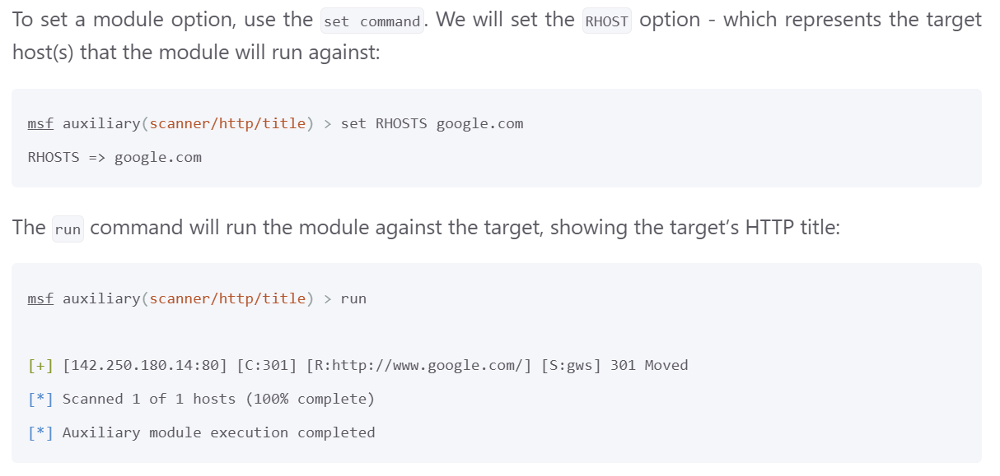
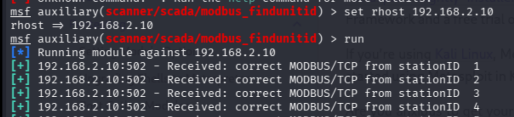
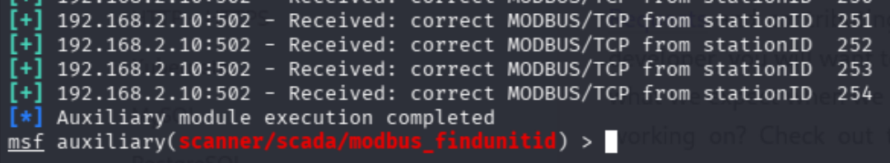
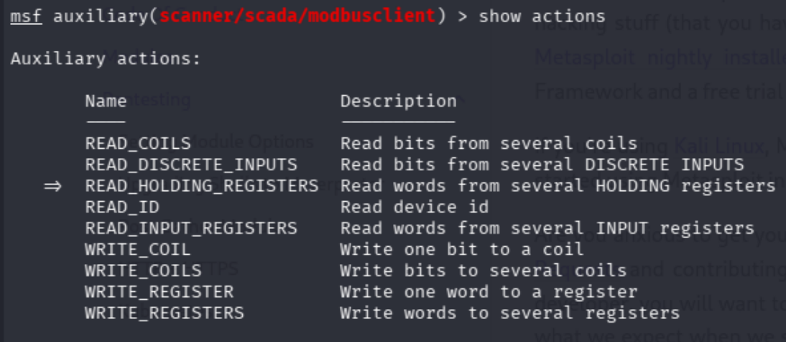
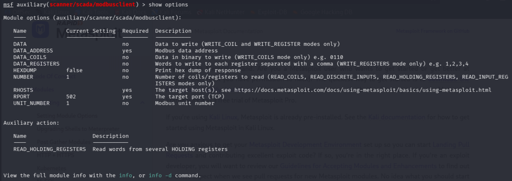

# OT - Pentest
In dit lab gaan we oefenen met het pentesten van een Modbus PLC systeem, we gaan het
geheugenblok uitlezen en manipuleren. Zorg ervoor dat je het OT-lab hebt opgezet en dat het werkt.
Werkt het niet, kijk dan naar het document “Lab inrichten V3.pdf” om dit op te lossen. We gaan in dit
lab aan de slag met verschillende tools voor het pentesten van de OT-omgeving. De opdrachten zijn
meer doe opdrachten en bij sommige zul je het zelf moeten gaan uitzoeken.

Benodigdheden: Kali Linux

## 1. opstarten Labomgeving
- `docker-compose up -d`
- Controleer of alle containers draaien: `docker ps`

---

## 2. Controleren of PLC werkt
- Log in op PLC webinterface: http://127.0.0.1:8080/login
  - username: openplc
  - password: openplc
- Controleer of het programma plc-work werkt: Status: Running
- Werkt het programma niet klik dan op `Start PLC` om het op te starten

---

## 3. Monitoring – pagina in Openplc
**Plaats een screenshot en geef een korte beschrijving van wat je ziet op deze pagina**  
[autonomy edge - Modbus Addressing](https://edge.autonomylogic.com/docs/openplc-editor/communication/modbus/addressing)

  

wat ik zie:
- een overzicht van alle informatie van 2 pompen zoals:
  - flow rate, temperatuur, pressure en speed
- Type
  - Bool: iets dat true of false kan zijn, in dit geval aan of uit
  - INT: een rond getal, deze is terug te zijn bij de Value kolom
- Location: dit is een string waar elk letter iets betekent, bijvoorbeeld
  -  op pomp 1: `pump1_start` `%QX0.0`
    - `%Q` -> output 
    - `X` -> in Bits 
    - in [link van de workshop](https://edge.autonomylogic.com/docs/openplc-editor/communication/modbus/addressing#coils-(fc-1,-5,-15):~:text=0-,%25QX0.0,-Digital%20output%20bit) kan je opzoeken wat deze "dingen" betekenen
- Write: die is er alleen voor `pump1_start` en `pump2_start`
  - aan en uit buttons (true/false) voor pomp 1 en 2
- Value: de waarde van het onderdeel
  - `pump1_start` en `pump2_start` hebben boolean, daarom kunnen deze 2 alleen true of false zijn in deze kolom
  - derest zijn integers, en hebben daarom een geheel getal als voorde in deze kolom

---

## 4. Open de scada
Open de scada web-interface: http://127.0.0.1:1881  
**Plaats een screenshot en geef een korte beschrijving van wat je ziet**

ik zie:
- hoe olie van links onder door de dirty filters naar pomp 1 gaat. vandaar naar pomp 2 en als laatst naar de controll valves
- er zijn ook deze valves, die rood zijn
  - 
  - deze zijn gesloten (op dit moment, mischien kan ik later zie aan zetten)
- als laatst zie ik de info van de value kolom terug op deze pagina
  - flow rate, temperatuur, pressure en speed

---

## 5.1 Geheugen blok uitlezen met Mobus-cli
- Start en nieuwe terminal op en typ: `modbus --help`
  - Als output krijg je te zien hoe de commando gebruikt kan worden. Dus hoe het is gestructureerd
- Typ het volgende commando: `modbus read –help`
  - Als output krijg je te zien hoe de commando gebruikt kan worden. Dus hoe het is gestructureerd. Hier zien we ook de commando die we moeten gebruiken om de inhoud van het geheugen in te lezen
- Geheugen inlezen
  - Typ het volgende commando in: `modbus read [ip-adres] %MW0 22`
  - Hier zie je dat het geheugen-adres is gedefinieerd met `%MW` het geheugenbloknummer 0 en de lengte 22. Dus hiermee worden de eerste 22 heugenblokken gelezen

uit [OT-week3](https://github.com/vsheo/Minor-AD-CS-blok-3/blob/main/OT/OT-week3.md#opdracht-4-network-discovery-ip-route--layer-3) (bij opdracht 5):
- plc: `192.168.2.10`
- scada: `192.168.3.20`

**Noteer wat je ziet en leg het resultaat uit. Ondersteun dit met een screenshot**
PLC:
- `modbus read 192.168.2.10 %MW0 22`
- 

wat ik zie:
- een lijst van `%MW` 0 t/m 21
- `MW` staat voor [Memory Words](https://edge.autonomylogic.com/docs/openplc-editor/communication/modbus/addressing#memory-words-(via-holding-registers))
  - Holding Registers:
- `%MW10` en `%MW20` staan op 50, de rest is op 0

[wat is memory word](https://www.quora.com/What-is-a-%E2%80%9Cmemory-word%E2%80%9D-in-PLC):

  
wat is memory word screenshots

    
    
  

memory word is een adress waar je gegevens kan opslaan, en later kan ophalen 

De command `modbus read 192.168.2.10 %MW0 22` laat dus zien wat in memory word 0 tot 22 opgelagen is

SCADA:
- `modbus read 192.168.3.20 %MW0 22`
- 
Dit geeft een error  
omdat `%MW0 22` alleen op plc ip gelezen kan worden, (omdat plc het apparaat kan beheren)
scada is alleen om te zien war er op de machine gebeurt

---

## 5.2 Geheugenblok manipuleren
Nu zullen we het geheugenblok gaan manipuleren namelijk de holding registers

- Typ: `modbus write –help`
  - Als output krijg je te zien hoe de commando gebruikt kan worden. Dus hoe het is gestructureerd. Hier zien we ook de commando gebruikt dient te worden
- Nu zal de waarde de 11de geheugenblok worden gewijzigd naar 87. Omdat de telling bij nul begint is het adres van dit geheugenblok %MW10
  - Type de volgende commando: `modbus write [ip-adres] %MW10 87`
  - **Maak de monitoring pagina open en noteer welke parameter gewijzigd is. Ondersteun dit met een screenshot**
- Manipuleren van het coil register. Type het volgende commando om het coil register in te lezen. : `modbus read [ip-adres] %M0 10`
  - Schrijf het commando om pomp1 uit te schakelen
 
`%MV10` de 11de geheugen plek/locatie veranderen:
- `modbus write 192.168.2.10 %MW10 87`
- de pomp 1 speed_in en speed_out zijn nu veranderd naar 87
  - 
  - 
> `%M` is de memory, `%i` is de input en `%Q` is de output  
> Ze hebben allemaal `W10`, dus wat opgeslagen is in `W10` zorgt voor snelheid (de speed_in en speed_out) van pomp 1  
> als je de Memory van `W10` veranderd dan veranderd de input en output mee,  
> volgens mij omdat de input(%I) en output(%Q) lezen wat in de memory(%M) opgeslagen is  

### Resetten van de labomgeving
- Typ eerst : `docker-compose down`
- Vervolgens : `docker-compose up -d`

nadat de lab opnieuw opgestart was, zag ik dat de speed voor pomp 1 terug was op 50:  
  

---

## 6. UnitID
- Start Metasploit en type : `search modbus`
  - Start Metasploit: `msfconsole`
  - metasploit documentatie: https://docs.metasploit.com/
- Kies vervolgens voor modbus_findunitid : `type 12`
  - Gebruik “info” om meer informatie te vergaren over de module
    - `use auxiliary/scanner/scada/modbus_findunitid` 0f `use 12`
    - `info`
      - [using metasploit](https://docs.metasploit.com/docs/using-metasploit/basics/using-metasploit.html)
  - Geef aan de juiste rhost en start de module
    - rhost staat voor remote host, hier moet ik de PLC IP aan geven, zodat metaspoilt weet met welk device het moet verbinden. Daarna kan ik metasploits dingen kan doen op de PLC
    - `set rhost`
    - 
    - in mijn geval: `set rhost 192.168.2.10`
    - daarna `run`
- **Noteer wat je ziet en leg het resultaat uit. Geef aan wat een station ID is en ondersteun dit met een screenshot**  

  
  
wat ik zie:
- dat de de IP van mijn PLC is toegevoegd aan rhost
- en de `run` command wordt een request gestuurd naar alle station IDs, en allemaal reageren met Received: Correct, dit betekent dat alle station IDs requests kunnen accepteren

---

## 7. Modbusclient Utility
- Kies vervolgens de modbusclient utility met commando: `use 2`
  - terug gaan command: `back`
  - `search modbus`
  - `use 2`
- Om te kijken wat je allemaal met deze module kunt doen typ : `info`
  - This module allows reading and writing data to a PLC using Modbus protocol
- Zoals te zien is kunnen er verschillende acties worden uitgevoerd. Om te zien welke acties binnen de module worden uitgevoerd kun je gebruik maken van het commando : `show actions`
  - 
    - Een actie kun je vervolgens selecteren met : `set action [naam van de actie]`
  - Met `show options` krijg je een overzicht van alle parameters die je moet aanpassen
    - 

---

## 8. Geheugenadressen zoeken
We gaan nu proberen beide pompen aan te zetten en het toerental van de pompen maximaal te zetten

- Configureer
  - het data_address met waarde 0,
  - NUMBER met de waarde 25 en
  - RHOSTS met het IP address van de PLC
  - en het UNIT_NUMBER 1
  - **Maak een screenshot en geef een korte uitleg wat je daar ziet(zie de info screenshot)**
- Start de scanner: `run`
  - **Maak een screenshot van het resultaat en leg uit wat je ziet**
- Kijk wat je nog meer kan uitlezen met het commando show actions.
  - Selecteer nu met set actions de actie READ_INPUT_REGISTERS en start de scanner opnieuw.
  - Doe dit ook voor de actie READ_COILS.
  - **Maak een screenshot van de resultaten**
- De waardes zijn de instellingen van de PLC.
  - Analyseer de hierboven gevonden resultaten en controleer op de SCADA of je deze waardes kunt koppelen aan de waardes daarop.
  - Kijk hiervoor alleen naar de waardes van de coils en input registers.
    - Dit zijn namelijk de enige waardes die we met deze tool kunnen aanpassen.
  - Verander de snelheid van de beide pompen en zet beide pompen aan of uit (afhankelijk van de huidige status).
  - Lees de geheugenwaardes uit opdracht 4 overnieuw uit.
    - Je ziet nu dat er specifieke waardes veranderd zijn. Dit zijn de instellingen van de pomp

---

## 9. Geheugenadressen aanpassen
We hebben nu de juiste geheugenadressen gevonden.  
Dit zijn 2 coils en 2 registers. We gaan deze nu via Metasploit aanpassen.

- Kopieer de read output naar een tekst bestand en pas deze aan.
  - Kijk goed in metasploit bij options hoe de dataregisters en de coils geschreven moeten worden.
- Zet beide pompen aan. Verander hiervoor de gevonden coils waardes en kopieer de binary data in het veld DATA_COILS.
- Zet de correcte actie: set action WRITE_COILS en start de scanner met run.
  - **Maak een screenshot van het resultaat en verifieer op de SCADA of de pompen aan staan.**
- Verander de snelheid van beide pompen. Verander hiervoor de gevonden input register waardes en kopieer de register waardes naar het veld DATA_REGISTERS.
- Zet de correcte actie: set action WRITE_REGISTERS en start de scanner met run.
  - **Maak een screenshot van het resultaat en verifieer op de SCADA of de pompen op vol vermogen aanstaan. Wat valt je op?**
- Zet nu beide pompen via metasploit uit. Maak een screenshot van het resultaat

