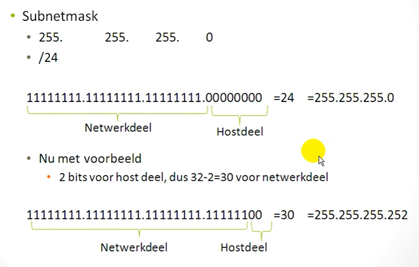

# Command Line Inferface - commands

- eerst zit je in de `user mode`
  - met `?` command zie je een lijst van alle commands die je kan uitvoeren
- `enable` of `en`: privilaged mode aan zetten
  - nu geeft `?` command zie je veel meer opties
- bij een verkeerde command kan je vast zitten, om eruit te gaan: `ctrl shift 6`

modes die er zijn en hoe je naar de volgende kan gaan:
- user mode -> `Switch>` + `enable`
  - privileged mode -> `Switch#` + `configure terminal` of `conf t`
    - configure mode -> `Switch(config)#` + `interface ... ..`
      - configure mode -> `Switch(config-if)#`

---

## fastEthernet (fa0/1)
hiervoor heb je privilage mode maar ook configure terminal nodig  
- `enable`
- `configure terminal` of `conf t`

om fa0/1 uit te zetten moet je naar de interface configuratie mode gaan
- `interface fastEthernet 0/1`
- `shutdown`, om fa0/1 uit te zetten
- `no shutdown`, om fa0/1 weer aan te zetten
> ook hier kan je de `?` command gebruiken om te zien welke command je kan gebruiken

---

## Als je een fout hebt gemaakt
dit geld voor alle commands:  
- schrijf je command die je weg wilt halen (pijltje naar boven)
- schrijf `no` ervoor  

bijvoorbeeld: `no` `ip route 192.168.5.0 255.255.255.0 192.168.2.2`

---

## Ip-addressering
Een IP address aangeven op een poort doe je binnen de interface-configuratie:
- `interface fa0/0`
- `no shutdown`, zodat de poort aan gaat
- `ip address`, ook op dit moment kan je `?` doen om te kijken hoe je het verder invult
  - `ip address` + `Ip address` + `subnet mask`

bijvoorbeeld:
- `interface fa0/0`
- `ip address 192.168.1.1 255.255.255.0`
> nu is de ip 192.168.1.1 verbonden aan de poort fastEthernet0/0

---

## Ip route
wordt gedaan in de config mode (`(config)#`)  
met de gui was dit:
- naar static
- eerst ip van waar je naartoe wilt gaan
- de subnet mask
- hoe je daar naar toe gaat, de next hop (waar de de request naartoe stuurt)

in de cli:
- `ip route`
  - `ip route` `Ip adress` `subnet mask` `next hop`
  - bijvoorbeeld `ip route` `192.168.5.0` `255.255.255.0` `192.168.2.2`

nu dat je static routes hebt gemaakt kan je met `ping` testen als ze goed verbonden zijn.  
Bijvoorbeeld:  
op een `PC` -> `Desktop` -> `Command prompt`, daarin de ping command:  
`ping` + `Ip address`: `ping 192.168.3.2`

### show
met `show running-config` kan je zien wat er op de router is ingesteld  
> enter is per regel, spatie is per pagina

met `show ip route` kan je zien welke ip adreress aan welke poort verbonden is (de routing table)

---

## Beveiligen 
### privileged mode password
binnen `conf t`  
- `enable password 12345a`
  - de password is in dit geval `12345a`

met deze password kunnen mensen wel op de user mode komen, maar niet verder naar configure mode gaan.  
Als iemand nu `enable` probeert dan moeten ze een wachtwoord invoeren.

### console poort
een router heeft maar 1 console poort, deze heet `console 0`.  
als deze niet beveiligd is dan kan iemand een kabel inpluggen en ook naar de configure mode toe gaan.  

beveiligen (binnen conf t):
- `line console 0`
- `login`, hiermee zeg je dat inloggen verplicht is
- `password`, een password maken om in te loggen

nu moet je inloggen voordat je op de user mode mag komen.  
en omdat we eerder ook een password hadden gezet voor privilaged mode(conf t), moet je nu 2 keer inloggen voordat je toegang hebt naar dat.

### telnet
bij desktop -> command prompt  
in de terminal bijvoorbeeld:  
`telnet 192.1681.1` - > `192.1681.1` is de ip van de router.  
met deze command krijg je remote toegang tot de cli van de router

beveiligen (ook via conf t):
- `line vty 0 4` -> virtual terminal line, dat is je telnet sessie. 0 4: geeft aan dat er maximaal 5 remote sessies mogen zijn.
- `login local` -> dit zegt gebruik de lokaal gebuikers voor login (via telnet)
  - lokaal gebruiker aanmaken(in config): `username bob password bob12345`

als je nu `telnet 192.1681.1` probeert, dan wordt je gevraagd om in te loggen met een username en password.

---

### Show commands
show commands worden binnen privileged mode uitgevoerd (enable)  
als je het binnen configuration mode (conf t) wilt uitvoeren, dan moet je `Do` ervoor plaatsen
> alle commands die alleen in privileged mode uitgevoerd kunnen worden, kan met `Do` ervoor in configuration mode uitgevoerd worden

- `show version`
- informatie van de switch ophalen (switch & router)
  - IOS versie
  - type switch
  - aantal Fa verbindingen
  - hoelang het online is
  - system serial number

- `show mac-address-table`
  - tabel met alle mac addressen ( alleen op switch )
    - DYNAMIC -> hij heeft het automatisch geleerd door verkeer op het netwerk
  
- `show arp`
  - vertaalt ip address om naar mac address, en omgekeerd ook ( alleen op router )
  - je ziet ook welke ip adress aan welke Fa verbonden is

- `show ip intetrface brief`
  - samenvatting van de interfaces op een apparaat ( switch & router )
  - ip address
  -  status en protocol: als het Up of Down is
  - zonder `brief` krijg je meer info

- `show history`
  - de alle commands die je op het apparaat hebt uitgevoerd ( switch & router )

- `show users`
  -  zie je de gebruikers verbonden met het apparaat ( switch & router )
    - ook remote users (telnet)

- `show ip route`
  -  overzicht van je routing table ( alleen op router )

- `show ip dhcp binding`
  - dan zie je alle ip addressen die uitgedeelt zijn ( alleen op router )
  - ook de mac address van het device wie de ip heeft ontvangen

- `show vlan`
  - welke vlans er zijn
  - en welke interfaces daarop ingesteld staan

- `show flash:`
  - kijken wat er allemaal in het flashgeheugen zit

- `show vtp status`
  - hoeveel vlans er aanwezig zijn
  - configuration revision -> als je wil dat alle switches dezelfde vlan database hebben, dan moeten ze dezelfde configuration revision nummer hebben

-  `show spanning-tree`
  - toont per VLAN welke switch de `rootswitch` is
  - laat zien hoe switches de root bereiken (cost)
  - toont welke poorten actief zijn en welke uitgeschakeld zijn om loops te voorkomen

- `show spanning-tree summary`
  - geeft een overzicht van in welke `STP-mode/rollen` poorten zich bevinden
  - toont hoeveel poorten actief, alternatief of uitgeschakeld zijn

- `show etherchannel summary`
  - toont welke interfaces deel uitmaken van een EtherChannel
  - laat zien of het EtherChannel actief is en correct werkt
  - geeft de gebruikte channel-groep en protocol weer

- `show etherchannel load-balance`
  - toont op basis van welke informatie het verkeer over de EtherChannel-links wordt verdeeld (load balancing methode)

- `show tech-support`
  - als iets stuk is, kan je hier info vinden over met wie je contact kan opnemen (switch & router)

- `show ?`
  - een lijst met alle show commands (switch & router)

---

## Back-up van de running-config
backups worden gemaakt op de router, en daarna doorgestuurt naar de ftp server.  

### Back-up maken
- `enable`
- `conf t`
- `ip ftp username cisco`
- `ip ftp password cisco`
- `do copy running-config ftp:`
  - na enter wordt je gevraagd voor de Ip van de ftp
  - en daarna een naam voor de backup, die mag je zelf bepalen

### Back-up importeren
- `enable`
- `conf t`
- `ip ftp username cisco`
- `ip ftp password cisco`
- `do copy running-config ftp:`
- `copy running-config startup-config` of `write memory`

---

### PC vraagt DHCP server of router voor een IP
dit gebeurt via een broadcast,  
de laptop vraag op het netwerk voor een IP, dit berichty gaat naar alle decices op  het netwerk.  
als het bij een router aankomt kan die een IP address terug sturen, maar alleen als de router is ingesteld om dat te doen.
deze braodcast wordt door de router beantwoord maa rowrdt niet verder gestuurd naar de buiten wereld

- `ip dhcp pool` `Ipvoorpc`
  - `Ipvoorpc` is de pool naam deze mag je zelf instellen
  - met deze command kom je in de `DHCP config` mode terecht
- `default-router` `192.168.1.1`
  - je eigen Ip address aangeven zodat deze niet gebruikt kan worden als antwoord op de broadcast
  - als deze router verder weg is van de PC bijvoorbeeld er een ander router ertussen, dan moet je hier de `first hop ip` plaatsen
- `network` `192.168.1.0` `255.255.255.0`
  - Hiermee geef je het netwerk op waarvoor de DHCP-pool IP-adressen mag uitdelen
  - `192.168.1.0` `255.255.255.0`: betekent dat de pool adressen binnen dat subnet kan toewijzen (192.168.1.1 t/m 192.168.1.254)

> dit is voldoende voor een router om ip addressen uit te delen
als je op de PC van `static` naar `DHCP` veranderd krijgt het automatisch een Ip address en een subnet mask

Als er een router tussen jouw DHCP router en de client zit, zal deze standaard geen broadcast berichten doorsturen.  
Om ervoor te zorgen dat de DHCP client toch een IP adres kan krijgen, moet je op deze tussenliggende router instellen:  
dat `DHCP broadcasts` worden doorgestuurd als `unicast berichten` naar de `DHCP server`

tussen router
- `interface fa0/0`
- `ip helper-address 192.168.2.2`
> luister op poort fa0/0 naar broadcast berichten  
als je die ontvangt  
stuur het door naar 192.168.2.2 - ip van de dhcp server

dhcp server
- `ip route 192.168.1.0 255.255.255.0 192.168.2.1`
  - een static route zodat de dhcp server weet naar waar hij zijn antwoort moet sturen
  - alleen nodig als er een tussen router is

---

## VLAN’s maken en interfaces koppelen
- `vlan 10` -> VLAN 10 aanmaken
- `name Inkoop` -> naam toewijzen
- `interface Fa0/1` -> interface selecteren
  - meerdere interfaces tegelijk op een vlan zetten
  - `interface range fa0/1-20` -> fa0/1 t/m fa0/20
- `switchport mode access` -> zet dew switch in access mode (niet nodig tussen switch->switch)
- `switchport access vlan 10` -> interface in VLAN 10 zetten

**Access vs Trunk:**
- Access: laat 1 VLAN door
- Trunk: laat al het VLAN-verkeer door
  - als je wilt dat dezelfde vlan's over 2 switches kunnen communiceren.  
  dan moet je de verbinding tussen de switches op trunk zetten

- VLAN worden lokaal opgeslagen in `vlan.dat`
  - verwijderen met `delete flash:vlan.dat`
    - nu zie je met `show vlan` nogsteeds de vlan die je verwijderdt hebt
    - dat blijft zo totdat je `reload` uitvoert

---

## InterVLAN Routing
als je een bericht van de ene vlan naar de andere wilt versturen, kan dan via de router.  
Om geen extra fysieke kabel per VLAN te gebruiken, laat je meerdere VLANs over een fysieke kabel lopen via trunking.  
dit noemen we ook Router-on-a-stick

- **Router-on-a-stick:**  
Subinterfaces aanmaken:
- `interface fa0/0`
- `no shutdown`
- `interface fa0/0.10` -> sub interface maken `.10` de naam van de vlan (zonder `.10` was het de hoofd interface)
- `encapsulation dot1q 10` -> truking voor vlan 10 instellen
- IP-adres instellen: `ip address 192.168.1.1 255.255.255.0` -> ip van het subnet dat bij het vlan hoort
- op de Switch interface naar trunk: `switchport mode trunk`
> dit is nu voor vlan 10 gedaan maar je moet het ook voor vlan 20 doen anders heeft dit geen zin

---

## VTP (VLAN Trunking Protocol)
**S0 (Server):** beheer de vlan database
- `vtp mode server` -> switch tot een vlan server maken
- `vtp domain` `Packettracer` -> domain waarin deze switches zitten en vlan data deelen
- `vtp password Welkom01`
- VLAN aanmaken:
  - `vlan 10`, `name Tien`
  - `vlan 20`, `name Twintig`

**S1 (Transparent):** stuurt vlan data door
- `vtp mode transparent`
- `vtp domain` `Packettracer` -> ook hier aangeven voor welke vlan domain doorgestuurd wordt
- `vtp password Welkom01` -> dezelfde pw als op de server
- debug: `debug sw-vlan vtp events`

**S2 (Client):** gebruik de vlan data uit de vlan server
- `vtp mode client`
- `vtp domain` `Packettracer` -> moet hetzelfde VTP domain hebben om VLAN updates van de server te ontvangen
- `vtp password Welkom01` -> dezelfde pw als op de server

---

## Spanning-Tree Protocol
Loops voorkomen met **STP**
- Verkiezing root: als een switch opstart/ aan en uit gaat, dan start een verkiezing voor welke de switch de `root bridge` wordt
  - bepaald door: `priority + MAC-address`
  - dit kan je beinvloeden door de priority aan te passen
    - `spanning-tree` `vlan 1` `root primary`
      - `root primary` zorgt ervoor dat de priority verlaagd wordt
      - met `show spanning-tree` zie je dat de priority verlaagd is
    - `spanning-tree` `vlan 1` `priority 61440`
      - priority veranderen naar `61440`
- Poort mode: Root, Alternative, Designated, Disabled
- Show: `show spanning-tree`, `show spanning-tree summary`
- Root aanpassen: `spanning-tree vlan 1 root primary/secondary`

> `RSTP` Rapid Spanning-Tree Protocol: snellere versie van STP
---

## EtherChannel
- Combineert meerdere fysieke verbindingen tot één logische link
- Meer bandbreedte + redundantie

### EtherChannel configuratie
LACP (standaard IEEE)
- `interface port-channel 1`
- `channel-protocol lacp`
- `interface range Fa0/1-5`
- `channel-group 1 mode active` -> andere kant: passive
> active  -> start LACP onderhandelingen  
passive -> wacht op LACP

PAgP (Cisco proprietary)
- `interface port-channel 1`
- `channel-protocol pagp`
- `interface range Fa0/1-5`
- `channel-group 1 mode desirable` -> andere kant: auto
> desirable -> start PAgP onderhandelingen  
auto      -> wacht op PAgP

ON (zonder protocol)
- `interface port-channel 1`
- `interface range Fa0/1-5`
- `channel-group 1 mode on`
> beide kanten moeten mode on gebruiken

Load balancing: `port-channel load-balance <optie>`  
Show: `show etherchannel summary`, `show etherchannel load-balance`

---

## Multilayer Switch (MLS)
IP op een interface instellen:
- `int fa0/1`
- `no switchport` -> geeft aan dat je op deze interface een ip wilt instellen
- `ip address` `192.168.1.1` `255.255.255.0`
- `ip routing` -> routing in zodat de ML-switch verkeer tussen netwerken/VLANs kan routeren

---

## Beveiliging Accesslaag
**VTP beveiliging:**
- `vtp mode server`
- `VTP domain packettracer`
- `vtp password Welkom01`

**STP beveiliging:**
- `Switchport mode access`
- `spanning-tree bpduguard enable` -> BPDU-berichten uitschakelen
- `spanning-tree guard root` -> poort mag geen root worden
> Het is overigens gebruikelijk om interfaces die niet gebruikt worden, standaard uit te zetten `shutdown`

**Port-security:**
- `switchport mode access`
- `switchport port-security`
- `switchport port-security maximum` `<aantal>`
- `switchport port-security mac-address` `<adres>` of `sticky`
  - bij `<adres>` de mac address invoren
  - bij `sticky` alleen sticky toevoegen

---

## Routring table
`Tracert` `192.168.3.2`
  - dit is de tracing route van deze PC naar PC met IP `192.168.3.2`
  - laat zien hoeveel hops een bericht aflegt. Alternatieve paden kunnen worden ingesteld door routing-tables anders te vullen.

---

## Subnetten
Ip addressering:  
- nummer je netwerk van groot naar klein
- uitrekenen hoe groot je grootste netwerk is
  - Laag 3 apparaten tellen
  - +2 doen voor netwerk id en broadcast ip
- Nagaan hoeveel bits je nodig hebt
  - stel je hebt 4 ip addressen nodig, met 2 bits kan ik 4 combinaties maken
  - 00=0, 01=1, 10=2, 11=3
- aantal Host-bits min 32 = je network deel (subnetmask)
- Netwerken uitrekenen

1bit -> 2 combinaties
2bits -> 4 combinaties
3bits -> 8 combinaties
4bits -> 16 combinaties

